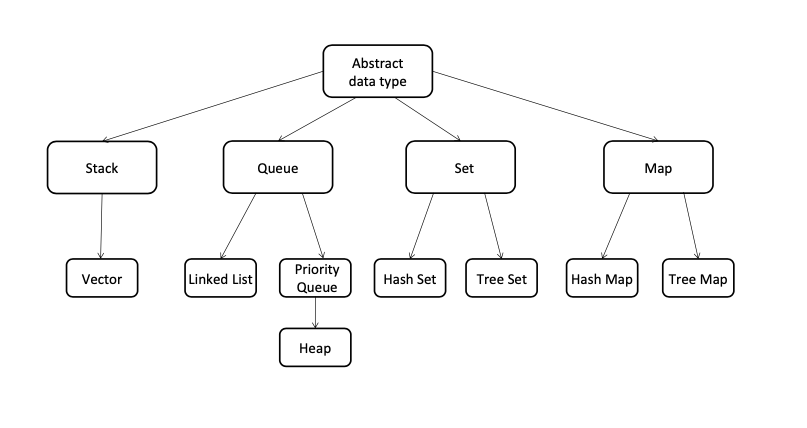
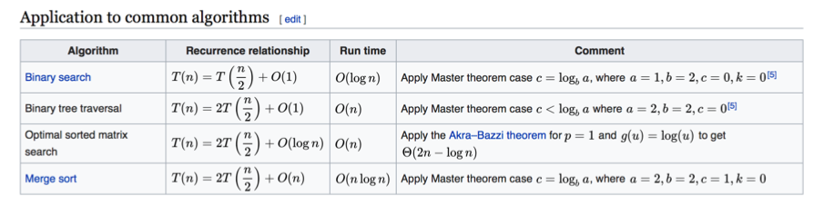

# 算法与数据结构

## 为什么学习

- 内功
- 大厂要求
- 手写
- 有趣且实用

## 如何学习

### 关键

- chunk it up
  - sorting
  - link list
  - list
  - spanning tree
  - tree
  - graph
  - stack
  - hashing
- deliberate practicing
  - 练习不足、缺陷之处
  - 过程会不舒服
- feeback
  - 主动
    - github
    - LeetCode
  - 被动
    - code review

### 切题四件套

- Clarification
- Possible solutions
  - compare ( time / space )
  - optimal 
- Coding
- Test cases

### 脉络

## Data Structure

- Array
- Stack / Queue
- PriorityQueue
- LinkedList
- Tree / Binary Search Tree
- Hash Table
- Disjiont Set
- Trie
- BloomFilter
- LRU Cache

## Algorithm

- General Coding
- In-order / Pre-order / Post-order traversal
- Greedy
- Recursion / Backtrace
- Traversal
- Breadth-First Search / Depth-First Search
- Divide and Conquer
- Dynamic Programming
- Binary Search
- Graph

## 时间复杂度和空间复杂度

### 证明

略

### 表达

- O(1)
- O(log n)
- O(n)
- O(n^2)
- O(n^3)
- O(2^n)
- O(n!)

注：只看最高复杂度

### 常见时间复杂度

